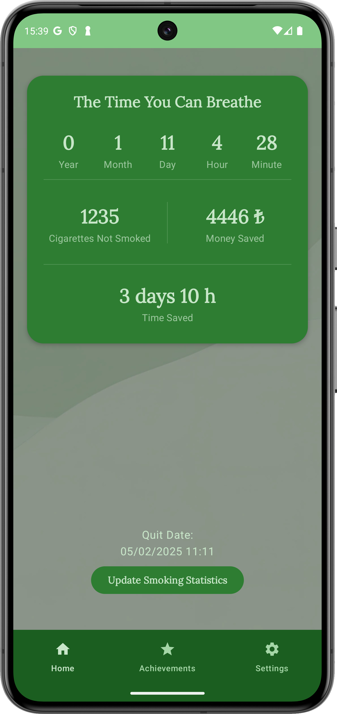
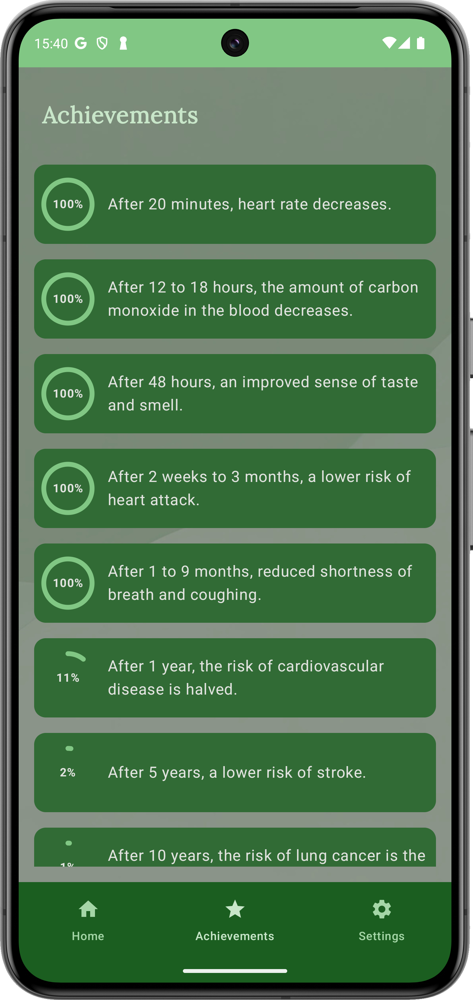
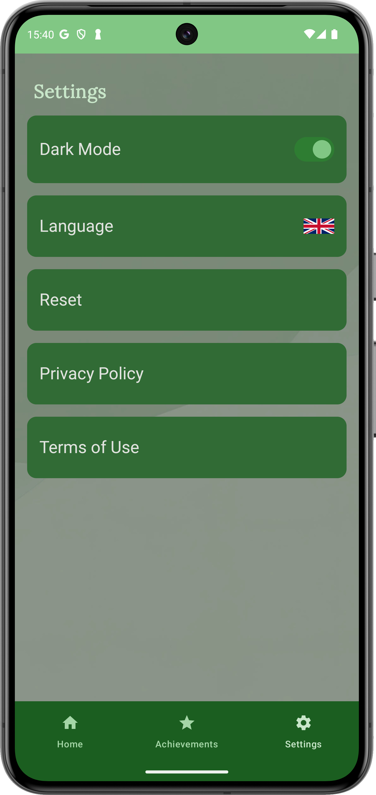

# Nefes Al

Nefes Al is an Android mobile application designed to help users quit smoking and track their progress. The app provides valuable insights into users' smoking cessation journey, including the time since quitting, money saved, and health improvements.

## Technologies Used
- Jetpack Compose
- Kotlin Flow
- MVVM
- DataStore
- Firebase Crashlytics

## Features

### Home Page
- Users can select their quit date.
- Displays:
  - Time since quitting.
  - Money saved.
  - Time saved.

### Achievements
- A section to track health status.
- Users can monitor their health improvements over time.

### Settings
- Language selection.
- Dark mode toggle.
- Data reset option.
- Privacy policy and terms of use.

## How to Use

1. **Set Your Quit Date:** On the home page, select the date you quit smoking.
2. **Track Your Progress:** Monitor the time, money, and health improvements in the home section.
3. **Explore Achievements:** Check your health status and improvements.
4. **Adjust Settings:** Change the language or toggle dark mode in the settings menu.

## License

This project is licensed under the MIT License - see the [LICENSE](LICENSE) file for details.

## Contact

For any inquiries, please contact:
- Email: [hikmettutuncu@outlook.com](mailto:hikmettutuncu@outlook.com)
